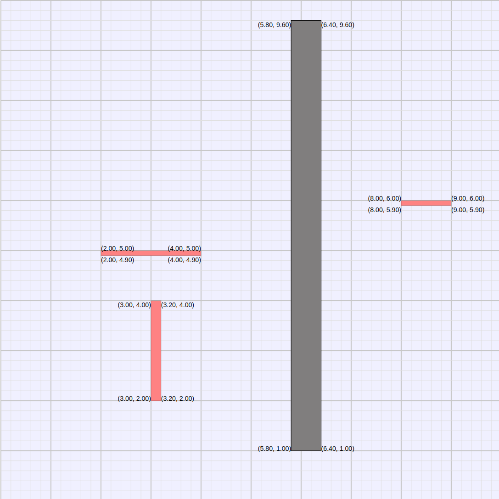
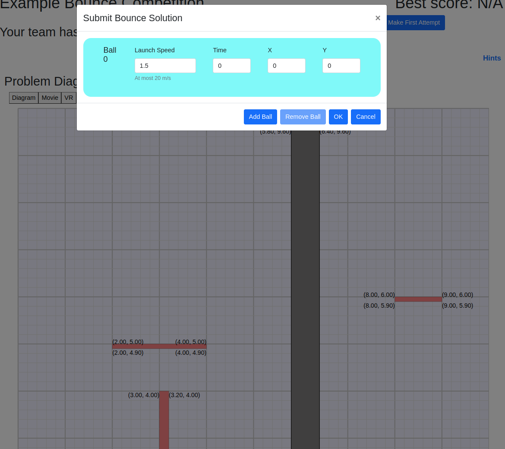
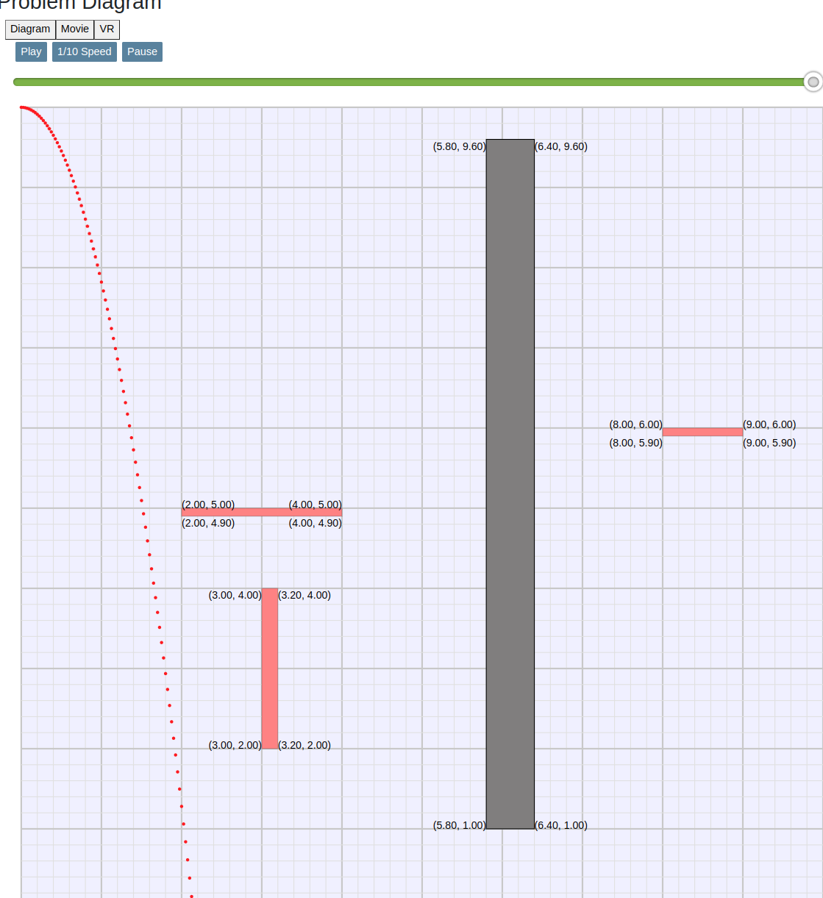
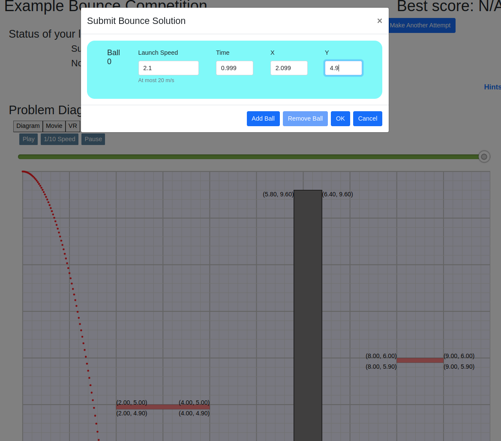
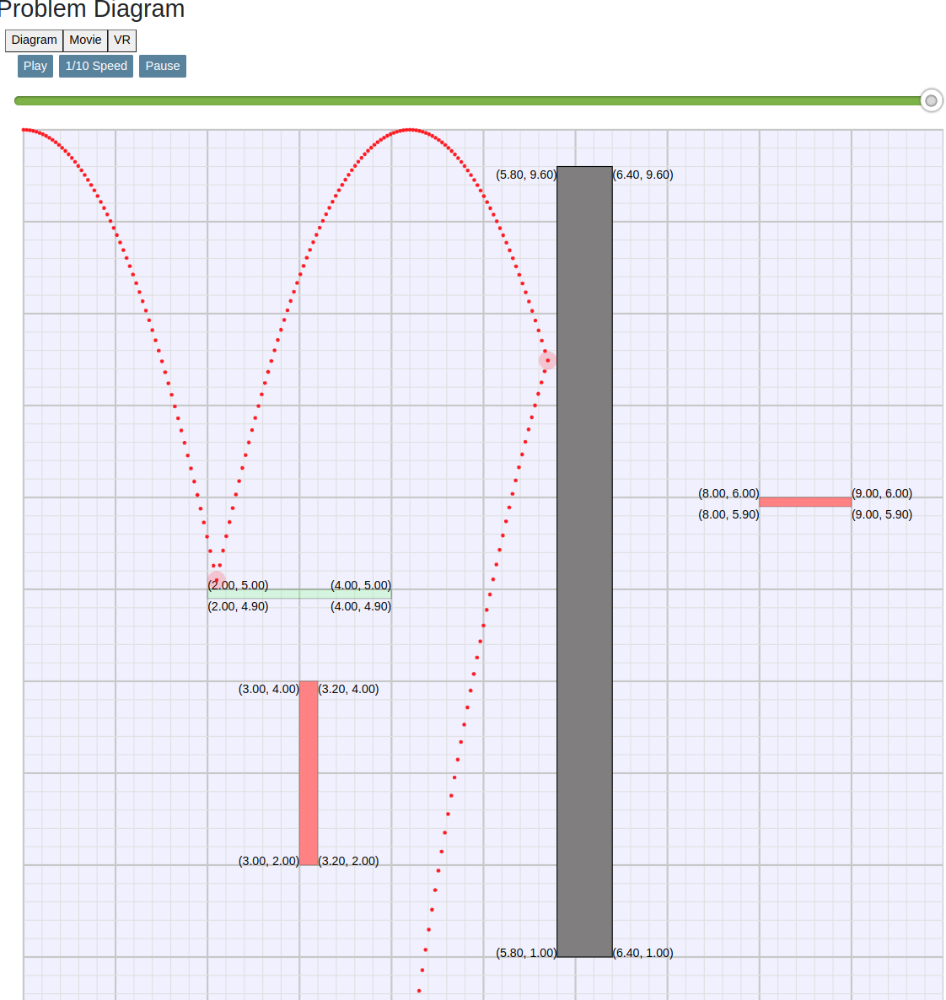
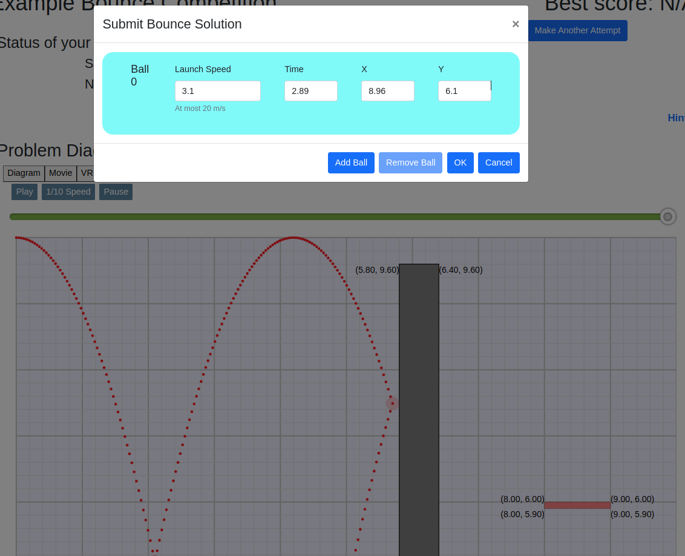
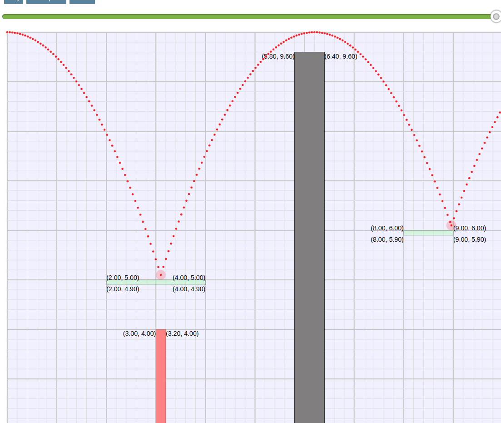
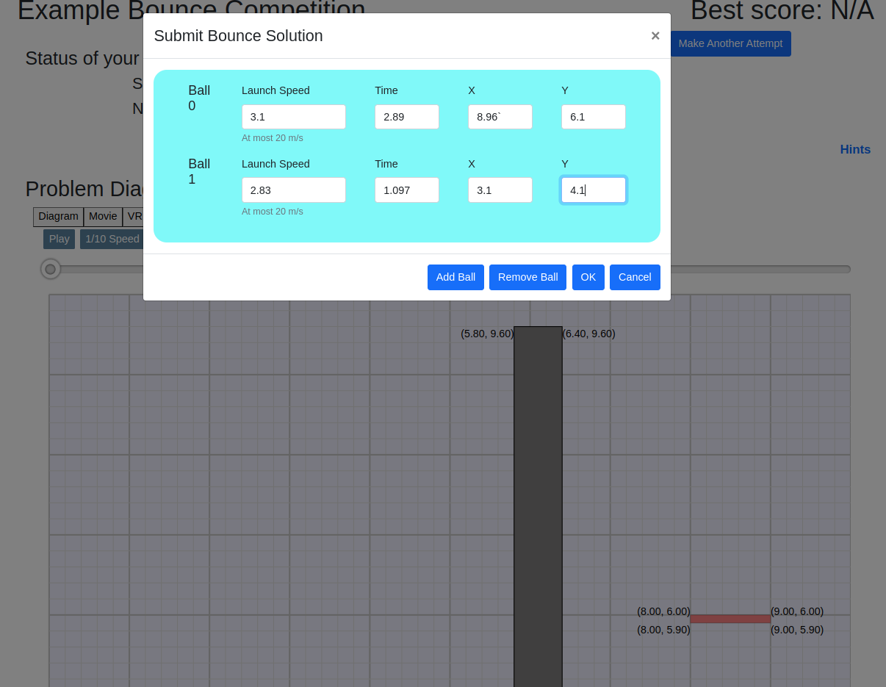
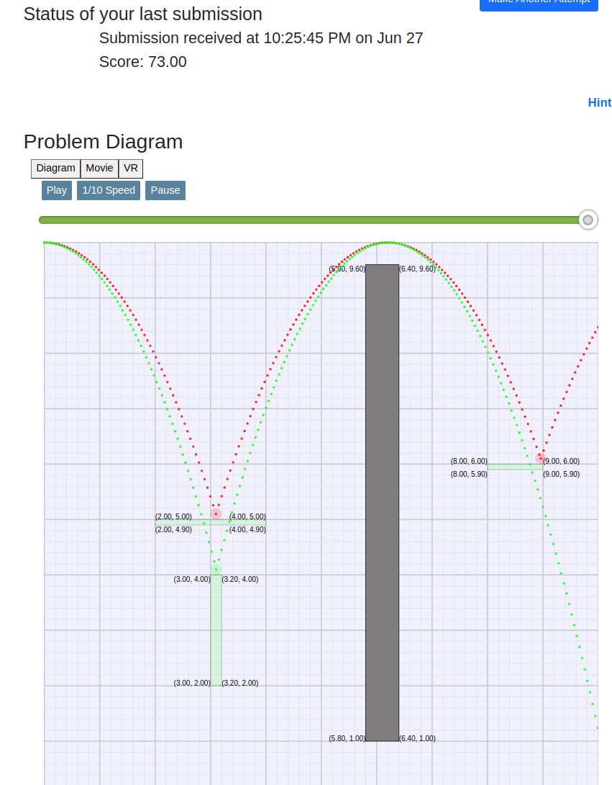
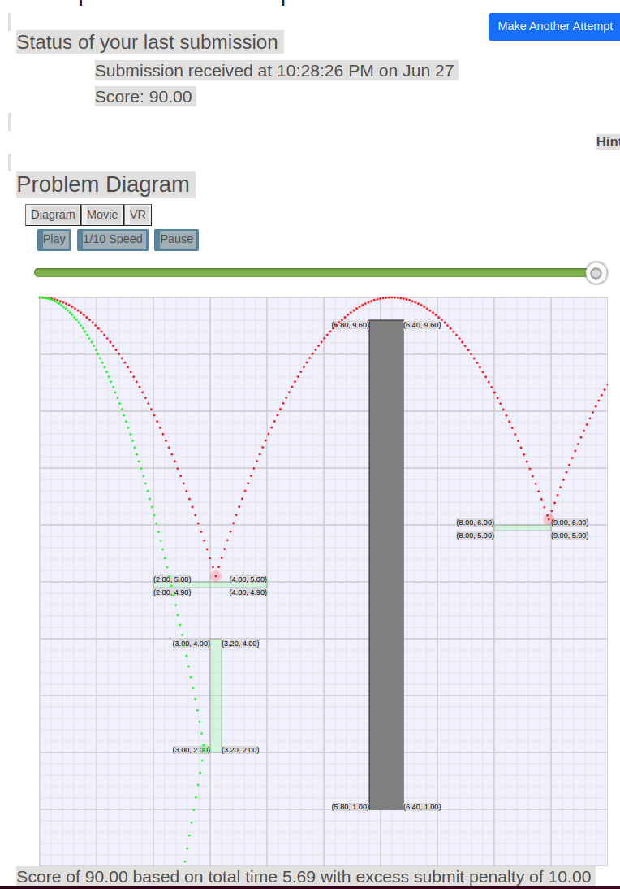

<link rel="stylesheet" type="text/css" media="all" 
 href="../../../../CmpDocs.css" />

# Hints for Bounce Example Competition

## Overview
These hints will give you direct answers for the example Bounce competition, 
along with some of the reasoning behind the answers. (See 
[Detailed Bounce Instructions](../../Instructions.html) for full details on the rules.)

## The Competition

The example competition has three red targets, and one black barrier.  

### A Random Try

Let's start by shooting just one ball from the upper left corner, trying to hit
the upper leftmost red target.  Maybe 1.5 meter/sec will do the trick...

We click Make First Attempt and enter a 1 m/s speed for one ball.  The competition
also requires that we enter the time and location of the ball collision, but 
we'll leave that all-zeros for now.

Click the OK, and wait a brief moment while the system evaluates our design...

We get "Invalid solution" because we left the time and location of the collision
as all zeros, but we can still see what our design did.  Click the Play button 
to see that 1.5 m/s makes the ball drop short of our desired target.

So, that didn't work.  We could always guess until we get the answer, but let's
try some physics instead.

### Precise Calculation for First Target

1. To hit the target, the center of the ball must fall 4.9 meters, because it starts at 10m, and
the top of the target is at y = 5.0.  (note the (x,y) labels on its corners.  
That might seem like a 5m fall, but the ball radius is .1m, so the ball center 
only falls from y=10 to y = 5.1m -- a drop of 4.9m

2. With gravity of 9.81 m/s, the standard gravitational acceleration equation
shows the ball will fall 4.9m in .999 seconds.  (Check this on your own, possibly
with help from an instructor.)

3. So, a speed of say 2.1 m/s will make the ball travel to the right 
$.999 * 2.1 = 2.099$ meters as it falls, which should just hit the target's left
edge .  

Let's do another attempt, entering 2.1 m/s, and the collision time of .999 and 
location of x = 2.099 and y = 4.9.

And we hit the target, which turns from red to green to indicate it was hit.

But, it's still an "invalid attempt" because we didn't hit all the targets, and
we did hit the barrier.

### Hitting Two Birds with One Stone

If we arranged it right, perhaps we can bounce the ball *over* the barrier, and
get the target on the right as well.  Did you notice how the ball arcs all the 
way back up to 10m on the bounce?  A perfectly elastic bounce loses no kinetic 
energy, so the ball rises all the way back to its original height.  And during 
the entire flight, the horizontal speed remains constant if all the collisions 
are purely in the vertical dimension.  So, let's adjust the speed so the ball 
hits the target
at x=3.0 or so, putting the peak of the bounce at around x=6.0, to go over the
barrier and hit the second target.

A speed of 3.1 m/s will do this.
(The math is left as an exercise.)

How we get a final collision at the far end of the second target, so
the ball nails two targets and leaves the scene as fast as possible.

### Getting the Third Target

The lower left target is hidden underneath the first target we hit, so we can't
get them both with one ball.  But, targets and barriers "retract" after
they're hit, so they're out of the way for later balls.  Let's add a second ball
to hit the lower target once the first ball has "cleared the way". 

The second ball's arc shows in green, hitting the top of the final target and
bouncing over the barrier. 

We finally have a "valid solution", since we nailed all targets without hitting 
a barrier, and we got the right final collision times and
x/y locations for both balls.

### Getting a Score of 100

But, our solution only warrants 73 out of 100 possible points.  A full 100 requires
that our final ball exit the scene as fast as possible.  We can do this by hitting
the *side* of the final target and dropping off the bottom, which will take much
less time than bouncing the second ball over the barrier.

Now the second ball bounces low on the side of the target for the fastest possible
exit.

This would get us 100, but we got penalized 10% becasue used too many attempts.  
If we'd done
exact math from the start, we would have been able to get to this point with a
single attempt.