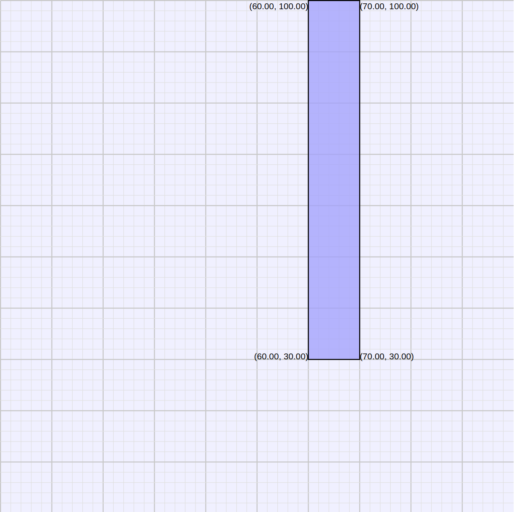
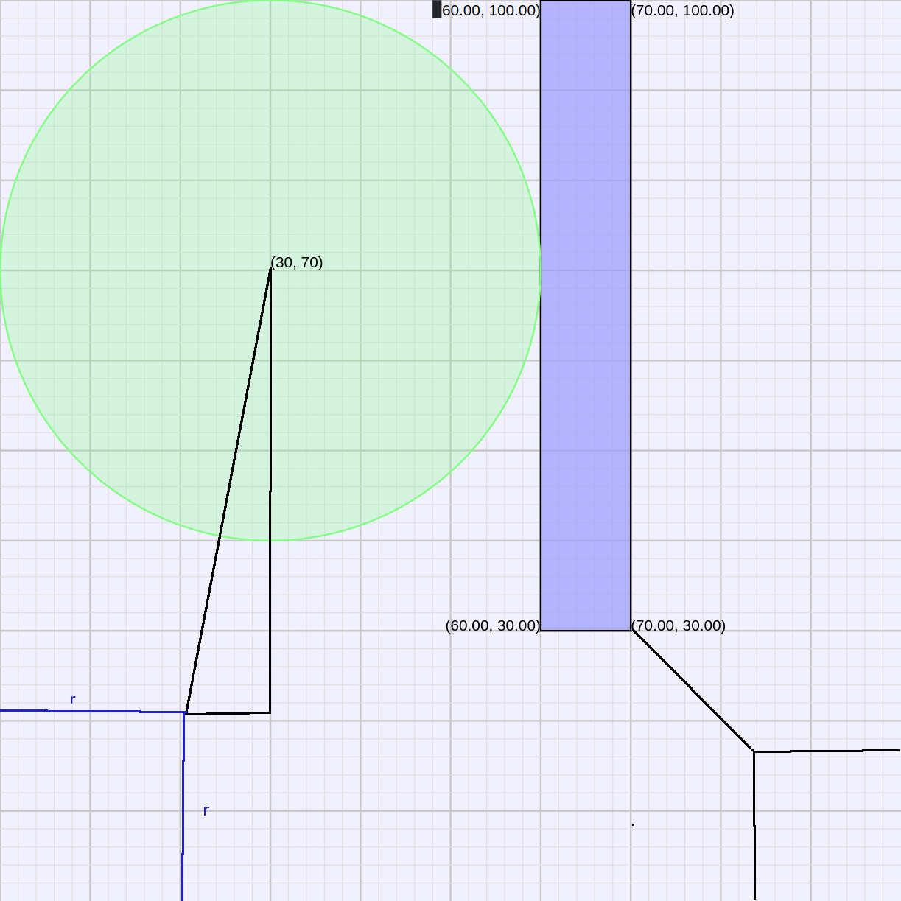

<link rel="stylesheet" type="text/css" media="all" 
 href="../../../../CmpDocs.css" />
 
# Basic Hints for Land Grab Competition

## Overview

This hint sheet covers a few basics for playing Land Grab, in particular ways
of finding the center and radius of circles that fit into a particular area.

We'll use this example layout for Land Grab, with a single obstacle of width
10 and height 70, and we'll place three circles in it.

### Simple square or rectangular area
The simplest math is placing a circle of maximum radius in a rectangular area
like the upper left corner of the diagram.  

**What is the maximum radius circle that can fit into the upper left corner?**

You should be able to answer this with a bit of thought.  Note that the area's
width is less than its height so width is the constraining limit.  A radius of
30, half the width, is the highest feasible circle.

**What center coordinated will put the circle as high as possible?**

This is left as an exercise, with an answer shown below

### Cornered circle against a corner point
A more complex case arises in the lower right corner.  Here the largest circle
is bracketed by the right and lower sides, and by the barrier corner at (70, 30).
Importantly, that barrier, the circle center, and the lower right corner, are
in a line.  This makes computation of radius **r** simpler. 

**As a multiple of r, how far is the circle center from the lower right corner?**

It may help to recall that the proportions of a right isocoles triangle 
are 1, 1, $\sqrt{2}$. 

**As a multiple of r, how far is the (70, 30) point from the lower right corner?**

Just add in another r to the value you had for the distance between the center
and lower right corner.

**Finally, how far is (70,30) from the corner in actual terms?**

This value, combined with the same distance as a multiple of r, should give you
an equation to compute r.  Do so, and come up with a value between 17 and 18.

### Cornered circle against another circle

A more complex case 

### Circles
The final answer with all three circles:
