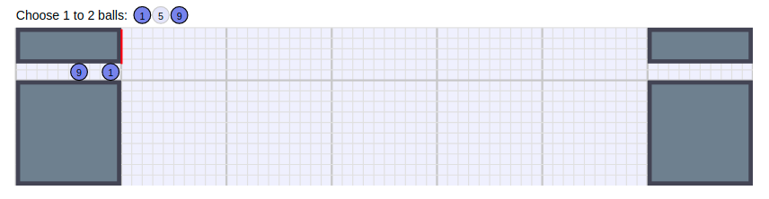

#Instructions for Rebound Competition

Notes:

1. 6 random balls; choose 3
2. 1 m long chute
3. All balls have initial speed and position up to 1 m/s
4. Gate opens at user-specified time <= 10s
5. 10m x 10m area
6. Must predict launch speed or final location?
7. Score based on speed
8. 

## Overview
In this competition, you'll arrange collisions between several balls of different masses in order to launch the rightmost ball as far as possible.

Here is a typical Rebound competition setup:

You are given two or more balls with varying masses from which may choose from 1 up to some maximum limit (2 in the diagram).  The ball choices appear in the upper part of the diagram, labelled by their masses.

Your task is to place the balls you choose in the 1 meter long *launch chute* to the left, where the 9 and 1 balls appear in the example, and to  assign a *speed* to each ball, so that collisions between the balls impart the highest possible rightward speed to the rightmost ball.  The rightmost ball is then launched across the open area in the middle, bounces once off of the floor, and precisely hits the *target chute* on the right side.  You assign the distance between the two chutes (the width of the middle area) according to the speed your setup gives the rightmost ball, so that the ball hits the target chute.  You get a score if the ball accurately hits the target chute, and your score is based on how large a middle-area width you traversed to do so.

## The Details

### Ball size and placement
The balls have 8cm radius (16cm diameter).  You specify the x-coordinate of their center in meters from 0 (left) to 1 (right) within the launch chute, and there must be at least 1cm between each pair of balls and between the left/right balls and the left/right ends of the chute.  Thus the centers in practice may lie between 0.09m and .91m, and must be at least .17m apart from one another.

### Ball speed
Initial ball speed may range from -1 m/s to 1 m/s, with negative values indicating leftward speed and positive indicating rightward.  Thus any one ball has limited initial speed.  The trick is to use ball collisions to get speeds that may be many times as large as the initial speeds.

### Open area size
When launched, the right ball drops exactly 1m from the launch chute to the floor, and bounces elastically back up 1m.  The distance between the two chutes is set by *you*, and must be such as to cause the launched ball to precisely hit the target chute (to have exactly height 1m as its center crosses the entrance to the target chute).  The longer this distance is, the higher your score, so maximizing the launch speed is essential.

### The gate
From the starting locations and speeds you supply, the balls bounce back and forth in the launch chute, with perfectly elastic collisions as they hit one another, or the sides of the chute. 

The left side of the chute is always blocked, but the right side is a *gate*, marked in red, which you may raise after the balls have bounced for some time.  If you raise it at 0 seconds, it's open from the start, but you may want to keep it closed for a time so that balls may bounce off the right side of the launch chute to gain speed.  At the time you specify, the gate opens, and the next time the rightmost ball reaches the right end of the launch chute, it flies out into the central open area.  The gate closes automatically after the rightmost ball launches, so none of the other balls will escape the launch chute.

### Scoring details

And, finally, you are only allowed 5 free submissions in which to refine your answer.  You may make more submissions if you need to, but your score goes down by 10% for each submission past the limit.

### Some numerical details
 * The diagram shows the corners of each target or barrier, in meters, measured from the bottom and left side of the playing area.  
  * The ball has a radius of .1 m, which you need to take into account when calculating impact times and locations.  
   * The simulated gravity is exactly 9.81 m/s^2.  
   * Each ball launches after the prior one has *entirely* left the playing area, not just when the prior ball's centerpoint leaves the playing area.
   * The diagram movie leaves a faded ball outline at each collision even though the ball moves on.  If the collision was with the **corner**, this faded outline is a square instead of a circle.

## Suggested Playing Strategy

### First Just try it out a bit
Since invalid solutions aren't penalized, start by just launching a ball or two, guessing several different speeds to hit a target or two.  Follow the diagram and see if you can calculate the impact times and locations you get from this.

### Use one ball per target
Once you've tried it out, calculate a solution that uses one ball per target.  This is the easiest kind of solution to do.  Calculate the time the ball will take to fall to the level of the target, and calculate the speed necessary for the ball to hit the target at that time.

### Now see if you can kill multiple targets per ball
Doing this requires calculating the timing of the ball as it rises and falls, computing the length of time for each rise and fall, and trying to get a horizontal speed that will hit all the desired targets at the right times.  Or, you can be more creative (some competitions require this) and bounce off the sides or even the bottom of targets)

### Speeding up the solution
The faster you hit all the targets, the better the score.  Thus, using fewer balls is generally a good idea, though a couple of fast balls may sometimes get the job done more quickly than one slow ball.  And for a given ball, using the fastest speed that will still hit all the targets is helpful.

## A Few Hints

### "Elastic" bounces
As you may know, "perfectly elastically" means the ball bounces away with the same velocity it hit, but with the velocity component in the direction of the target or barrier negated or reversed.  In the diagram below, the ball hits the rectangle with a downward velocity of 2 m/s and a horizontal velocity of 3 m/s.  After the collision, it has an *upward* velocity of 2 m/s, and the horizontal velocity is unchanged.  It's important to think of the ball's velocity in two components -- vertical and horizontal.

### Careful computation
As you get into the challenge, you'll find you need to do a lot of computations of ball falling and rising times, speeds, etc.  It's easy to make dumb mistakes.  Keeping an orderly table of your work, and double checking it, will save you from extra submissions.
